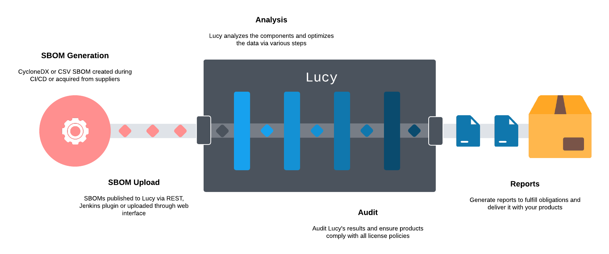
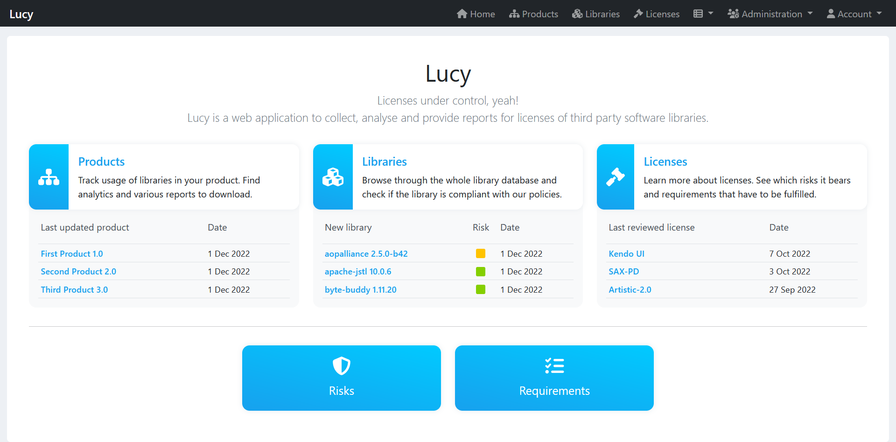
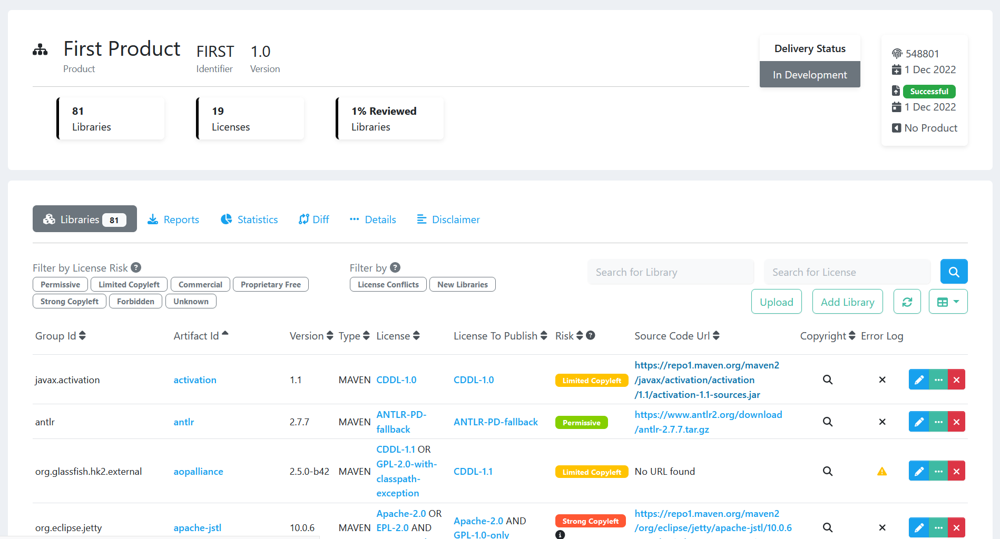

<p align="center">
  
</p>
<h1 align="center">Licenses under control, yeah!</h1>
Lucy is a component analysis platform to minimize the risk of license infringements and to support and optimize the license compliance process.

Third-party and open-source software typically has one or more licenses assigned. The chosen license may or may not allow certain types of usage, contain distribution requirements or limitations, or require specific actions if the component is modified. Lucy can identify the license(s) for a given component and provide guidance as to the nature of the license (i.e. license text, copyright, risk, source code, etc). Utilizing components with licenses which conflict with an organizations objectives or ability can create serious risk to the business.



## Features
- Track usage of components in projects
- Manage licenses with risk and requirements
- Supports standardized SPDX ID's
- Supports different uploads:
  - CycloneDX SBOM (XML)
  - CSV
  - Archives with Maven components (JAR, ZIP, WAR, etc.)
- Ecosystem agnostic with built-in repository support such as autocomplete of missing information for:
  - Maven (Java)
  - npm (Javascript)
  - PyPI (Python)
  - NuGet (.NET)
  - Golang (Go)
- Generate various reports to ensure compliant software deliveries
- Mapping for different license names
- Detects incompatible license combinations
- Supports Fossology API to start analysis of components
- Metrics for projects
- Monitor the development of projects and compare releases
- API-first design
- Local manageable users
- Runs as Docker container

## Build Docker Image
Lucy requires at least Java version 11.

Currently, only the correct and full functionality of Lucy is supported as a Docker image.

Build Docker image:
```shell
./mvnw package -Pprod verify jib:dockerBuild
```

Lucy is based on the JHipster framework. For further information check [JHipster](https://www.jhipster.tech/).

## Usage
The image is launched using docker-compose. Under */docker/docker-compose.yml* is a sample file. This starts Lucy and a PostgreSQL.

Start Lucy image:
```shell
docker-compose up -d
```

Lucy is reachable at localhost:8090 by default.

## Quickstart
When using Lucy for the first time, the user "admin" with password "admin" and "user" with password "user" exist. The passwords should be changed! 

Likewise, other users can be created.
The following roles can be assigned to users:
|  Role  |    Description    |
|--------|-------------------|
|Admin   |Full rights and access to admin view|
|User    |Rights to view, create, edit, delete products, components, licenses, etc.|
|Readonly|Rights to view products, components, licenses, etc.|

To start the initial analysis of an SBOM, it is recommended to create licenses first. Because without licenses the components cannot be identified correctly.

For a list of existing licenses, the [SPDX License List](https://spdx.org/licenses/) can be used. Each license should be assigned a risk and requirements. Risks and requirements are already predefined.

For the first analysis, a new product can now be created. In the product, an SBOM can be uploaded using the "Upload" button. It is recommended to create an SBOM with [CycloneDX](https://cyclonedx.org/). Only the XML format is supported.

Depending on the size of the SBOM, the first upload may take a while. After successful processing, the components are listed in Lucy.

|Main Page|Product Detail Page|
|---|---|
|||

## Copyright & License
Lucy is Copyright (c) 2022 Regnology GmbH. All rights reserved.

It is licensed under [MIT](../blob/master/LICENSE).
